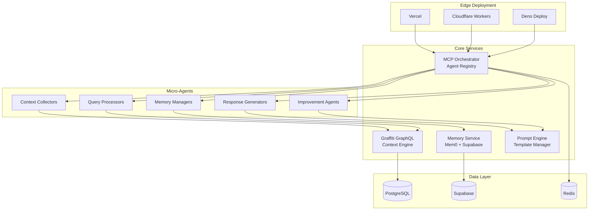

# # 🚀 Dynamic Context Collection & Auto-Deploy MCP System

[](https://codespaces.new/YOUR_USERNAME/dynamic-context-mcp-system)
[](https://gitpod.io/#https://github.com/YOUR_USERNAME/dynamic-context-mcp-system)

A comprehensive AI infrastructure system that dynamically collects context, manages micro-agents via MCP (Model Context Protocol) servers, and provides intelligent session memory with self-improvement capabilities for edge deployment.

## ✨ Features

- **🧠 Dynamic Context Collection**: Real-time context ingestion from multiple sources
- **🔄 MCP Micro-Agents**: Scalable agent architecture with automatic orchestration
- **📊 GraphQL Knowledge Base**: Graffiti-powered semantic context management
- **🧩 Session Memory**: AI-optimized memory with Mem0 integration
- **🚀 Auto-Deploy**: One-command deployment to Vercel, Cloudflare, Deno Deploy
- **📦 Containerized**: Complete Dagger-powered container orchestration
- **⚡ Edge-Ready**: Optimized for distributed edge computing
- **🔄 Self-Improving**: LLM-driven prompt optimization and learning loops

## 🏗️ Architecture



## 🚀 Quick Start

### Prerequisites
- GitHub account (for Codespaces)
- Or any Git provider (for Gitpod/local development)

### Option 1: GitHub Codespaces (Recommended)
1. Click the **"Open in GitHub Codespaces"** badge above
2. Wait for the environment to set up (3-5 minutes)
3. Run the quick start:
   ```bash
   make dev
   ```

### Option 2: Local Development
```bash
git clone https://github.com/YOUR_USERNAME/dynamic-context-mcp-system.git
cd dynamic-context-mcp-system
bash .devcontainer/setup.sh
make dev
```

## 🎯 Development Commands

```bash
# Start development environment
make dev

# Test Dagger setup
dagger call test-dagger

# Start basic GraphQL server
dagger call basic-graffiti-server up

# Start micro-agents
make agents

# Run tests
make test

# Deploy to platforms
make deploy-vercel
make deploy-cloudflare

# View all commands
make help
```

## 📊 Service Endpoints

Once running, access your services at:

- **Main App**: `http://localhost:3000`
- **GraphQL Playground**: `http://localhost:4000/graphql`
- **MCP Orchestrator**: `http://localhost:5000`
- **Prompt Engine**: `http://localhost:7000`
- **Memory Service**: `http://localhost:8000`

## 🔧 Configuration

### Environment Variables
Copy `.env.example` to `.env.development` and configure:

```bash
# Required API Keys
SUPABASE_URL=your_supabase_project_url
SUPABASE_ANON_KEY=your_supabase_anon_key
MEM0_API_KEY=your_mem0_api_key

# Optional
DAGGER_CLOUD_TOKEN=your_dagger_cloud_token
```

### Service Configuration
- **Graffiti**: GraphQL context engine with real-time subscriptions
- **Supabase**: User management, real-time updates, edge functions
- **Mem0**: AI-optimized session memory and semantic search
- **Dagger**: Container orchestration and deployment pipelines

## 🧩 Project Structure

```
├── packages/
│   ├── graffiti-server/      # GraphQL context engine
│   ├── mcp-orchestrator/     # Agent coordination system
│   ├── memory-manager/       # Session memory handling
│   ├── prompt-engine/        # Dynamic prompt management
│   └── agents/               # Micro-agent implementations
├── edge-functions/           # Platform-specific deployments
├── dagger/                   # Container orchestration
├── config/                   # Service configurations
└── scripts/                  # Automation scripts
```

## 🤖 Micro-Agent Types

- **Context Collectors**: Web scraping, API polling, file monitoring
- **Query Processors**: GraphQL queries, data transformation, caching
- **Memory Managers**: Session storage, context retrieval, pattern analysis
- **Response Generators**: Content synthesis, context injection, output formatting
- **Improvement Agents**: Performance analysis, prompt optimization, strategy updates

## 🚀 Deployment Options

### Edge Platforms
- **Vercel**: `make deploy-vercel`
- **Cloudflare Workers**: `make deploy-cloudflare`
- **Deno Deploy**: `make deploy-deno`

### Container Platforms
- **Kubernetes**: `dagger call deploy --target=kubernetes`
- **Docker Swarm**: `docker stack deploy -c docker-compose.prod.yml mcp-system`

## 🔄 Development Workflow

1. **Code in Cloud**: Use GitHub Codespaces for instant development
2. **Container Testing**: All services run in isolated containers
3. **Dagger Pipelines**: Automated testing and deployment
4. **Edge Deployment**: One-command deployment to multiple platforms
5. **Monitoring**: Built-in observability with Prometheus and Grafana

## 📈 Scaling & Performance

- **Horizontal Scaling**: Add more agent containers based on workload
- **Resource Management**: Fine-tuned CPU/memory allocation per service
- **Caching Strategy**: Distributed caching across container network
- **Load Balancing**: Automatic request distribution across agents

## 🧪 Testing

```bash
# Run all tests
make test

# Test specific components
dagger call test --component=graffiti-server
dagger call test --component=mcp-orchestrator

# Integration tests
dagger call test --type=integration
```

## 📚 Documentation

- [Architecture Overview](./docs/architecture.md)
- [API Documentation](./docs/api.md)
- [Deployment Guide](./docs/deployment.md)
- [Contributing](./docs/contributing.md)

## 🤝 Contributing

1. Fork the repository
2. Create a feature branch: `git checkout -b feature/amazing-feature`
3. Commit changes: `git commit -m 'Add amazing feature'`
4. Push to branch: `git push origin feature/amazing-feature`
5. Open a Pull Request

## 📄 License

This project is licensed under the MIT License - see the [LICENSE](LICENSE) file for details.

## 🙏 Acknowledgments

- [Graffiti](https://github.com/graffiti-org/graffiti) for GraphQL context management
- [Dagger](https://dagger.io) for container orchestration
- [Mem0](https://mem0.ai) for AI-optimized memory
- [Supabase](https://supabase.com) for backend infrastructure

## 🎯 Roadmap

- [ ] **Phase 1**: Foundation Setup ✅
- [ ] **Phase 2**: Core Agent System
- [ ] **Phase 3**: Dynamic Context Management
- [ ] **Phase 4**: Auto-Deploy Pipeline
- [ ] **Phase 5**: Self-Improvement System

---

**Ready to revolutionize AI infrastructure?** 🚀

